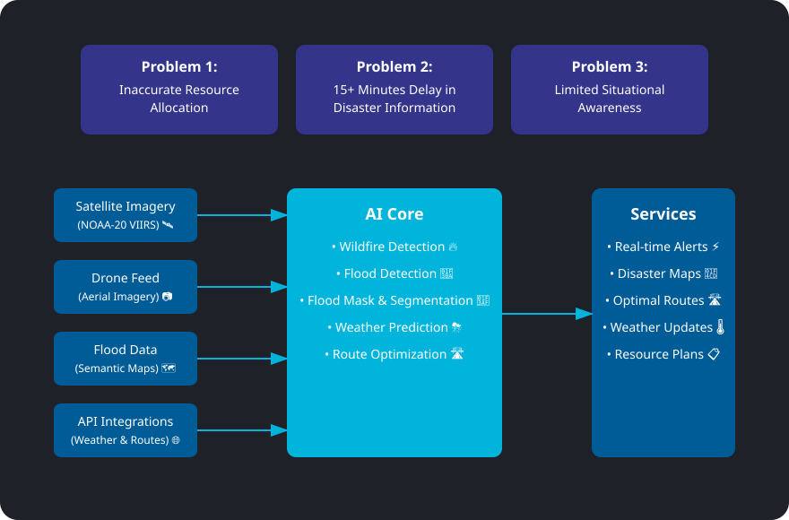

# 🚀 CrisisPilot - Smart Relief  
### *Transforming Disaster Response Through AI* 🌍

---

## 💡 Inspiration  
Natural disasters strike swiftly and unpredictably, causing widespread disruption and loss. Inspired by recent catastrophes and the need for faster emergency response, **CrisisPilot** harnesses the power of AI to enhance disaster management, speed up decision-making, and ultimately save lives.

---

## 🌟 Key Features  

### 🔥 Wildfire Detection  
- Real-time analysis of NOAA-20 VIIRS satellite imagery  
- 90.5% detection accuracy using transfer-learned **RESNET101**  
- Custom-tuned for varying terrains  

### 🚁 Drone-Based Victim Detection  
- Real-time human detection using **YOLOv8**  
- High-resolution drone footage processing  
- Supports aerial search & rescue missions  

### 🌊 AI-Powered Flood Mapping  
- Semantic segmentation with **U-NET**  
- Accurate mapping of affected areas  
- Helps with resource planning & evacuation  

### 💬 CrisisBot – Emergency Q&A Chatbot  
A multilingual, LLM-powered assistant designed to support users during emergencies.

- Built with **Mistral-Large2** via **Snowflake Cortex**  
- Retrieval-Augmented Generation (RAG) with **Cortex Search**  
- Offers survival tips, rescue info, and localized assistance  
- Integrated into a **Streamlit interface** for real-time interactions

**Example Queries:**  
- “Where is the nearest shelter?”  
- “How can I stay safe from wildfire smoke?”  
- “Is it safe to travel in this area?”

### 🧠 Integrated Emergency Response System  
- Real-time weather monitoring and geolocation-based risk prediction  
- Animal welfare tracking included  
- Intelligent alert distribution and dashboard visualization  

---

## 🏗️ Technical Architecture  

### ML Model Stack:
| Feature            | Model/Tech          | Highlights                          |
|--------------------|---------------------|--------------------------------------|
| Wildfire Detection | RESNET101           | 90.5% accuracy on satellite imagery |
| Victim Detection   | YOLOv8              | Real-time drone-based localization  |
| Flood Mapping      | U-NET               | Semantic segmentation of water zones |
| Emergency Chatbot  | Mistral + Cortex    | LLM-based multilingual assistance   |

---

## ⚙️ Data Pipeline Overview

**Input:**  
- Satellite data (NOAA-20 VIIRS)  
- Real-time drone feeds  
- User queries via chatbot  
- Weather & terrain info  

**Processing Layer:**  
- GPU-accelerated inference  
- RAG + LLM pipeline for natural language understanding  
- Automated alerts & risk prediction  

**Output:**  
- Emergency alerts 🚨  
- Resource allocation maps 🗺️  
- Real-time dashboards 📊  
- Interactive Q&A support 💬  

---

## 🚧 Challenges Faced  
- Handling massive satellite data in real-time  
- Optimizing models for varied weather/lighting conditions  
- Integrating multiple AI pipelines seamlessly  
- Scaling LLMs for high user traffic during emergencies  

---

## 🏆 Achievements  
✅ 90.5% wildfire detection accuracy  
✅ Real-time drone-based human detection  
✅ Flood segmentation and mapping  
✅ Fully functional LLM-powered chatbot  
✅ Unified web dashboard using **Streamlit**  
✅ Working prototype delivered within hackathon timeframe  

---

## 📚  What We Learned Through Building CrisisPilot 
- Advanced CV & NLP integration  
- Building robust RAG pipelines with Mistral LLM  
- Optimizing AI models for real-time performance  
- Designing user-centric interfaces for high-stress environments  

---

## 🌍 Social Impact  
- **Life-saving potential** in disaster-prone areas  
- **Empowers communities** with timely information  
- **Supports animal welfare** during evacuations  
- **Boosts resilience** and resource efficiency  
- **Scalable, adaptable, and globally impactful**

---

## 🛠️ Built With  
- 🐍 Python • 🔥 TensorFlow • 🛠️ PyTorch • 🤖 YOLOv8  
- 🎥 OpenCV • 🧠 Mistral LLM • 🌐 Snowflake Cortex & Cortex Search  
- 🖥️ Streamlit • 📡 NOAA-20 VIIRS Satellite Data  

---

  <h3>🚀 Built with ❤️ by Team CrisisPilot</h3>
  
🌍 Technology that saves lives!

